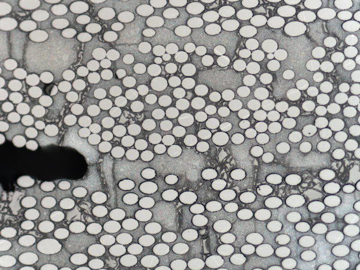
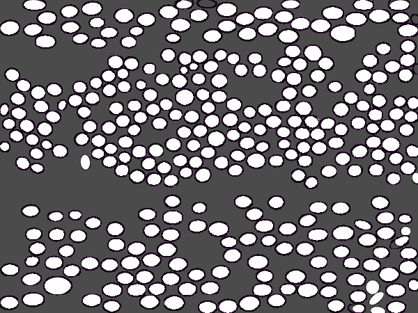

# FiberToolbox #

THe **FiberToolbox** is a plugin for [DREAM.3D](http://www.github.com/bluequartzsoftware/dream3d) that allows the user to extract ellipses from a 2D image. The plugin was primarily developed to extract fibers from a micrograph cross section of a Composite Material. (see image below).

The plugin has a single filter **DetectEllipsoids** that will output a new 2D ImageGeometry with the detected ellipses drawn into the ImageGeometry. In addition the filter will also save the following attributes of each ellipse:

+ X Coordinate of Center
+ Y Coordinate of Center
+ Major Axis Length
+ Minor Axis Length
+ Rotation of Ellipse in degrees

The algorithms implemented in this plugin are based off of a MATLAB implemenetation from the following research paper:

C. P. Przybyla, S. Bricker, J. P. Simmons, and R. Hardie, "Automated Microstructure-Properties Characterization and Simulation in Brittle Matrix Continuous Fiber Reinforced Composites.", _29th Annual Technical Conference of the American Society for Composites 2014_, Vol. 1

which itself implemented the algorithm described in the paper:

[2] Xie, Yonghong, and Qiang Ji. "A new efficient ellipse detection method." _Pattern Recognition, 2002. Proceedings. 16th International Conference on._ Vol. 2. IEEE, 2002.

## Funding ##

This plugin was developed under US Air Force Prime Contract __FA8650-10-D-5210__ by [BlueQuartz Software, LLC](http://www.bluequartz.net).

